# UML.md — Diagrammes UML LOWLY

## Table des matières

1. [Objectif de ce document](#1-objectif-de-ce-document)
2. [Convention de notation](#2-convention-de-notation)
3. [Diagramme de cas d'utilisation](#3-diagramme-de-cas-dutilisation)
4. [Diagrammes de classes](#4-diagrammes-de-classes)
   - 4.1 [Vue d'ensemble inter-domaines](#41-vue-densemble-inter-domaines)
   - 4.2 [Domaine Identity](#42-domaine-identity)
   - 4.3 [Domaine Partners](#43-domaine-partners)
   - 4.4 [Domaine Catalogue](#44-domaine-catalogue)
   - 4.5 [Domaine Availability](#45-domaine-availability)
   - 4.6 [Domaine Reservation](#46-domaine-reservation)
   - 4.7 [Domaine Communication](#47-domaine-communication)
   - 4.8 [Domaine Administration](#48-domaine-administration)
5. [Diagrammes de séquence](#5-diagrammes-de-séquence)
   - 5.1 [Demande de réservation](#51-demande-de-réservation)
   - 5.2 [Acceptation directe d'une demande](#52-acceptation-directe-dune-demande)
   - 5.3 [Refus avec contre-proposition — acceptation](#53-refus-avec-contre-proposition--acceptation)
   - 5.4 [Refus avec contre-proposition — expiration](#54-refus-avec-contre-proposition--expiration)
   - 5.5 [Refus simple](#55-refus-simple)
   - 5.6 [Blocage manuel de calendrier (véhicule)](#56-blocage-manuel-de-calendrier-véhicule)
   - 5.7 [Validation d'un partenaire par l'administration](#57-validation-dun-partenaire-par-ladministration)
   - 5.8 [Validation d'une annonce par l'administration](#58-validation-dune-annonce-par-ladministration)
6. [Diagramme d'états — Réservation](#6-diagramme-détats--réservation)
7. [Diagramme d'états — Contre-proposition](#7-diagramme-détats--contre-proposition)
8. [Diagramme d'états — Partenaire](#8-diagramme-détats--partenaire)
9. [Diagramme d'états — Annonce (Résidence / Véhicule)](#9-diagramme-détats--annonce-résidence--véhicule)
10. [Traçabilité avec la documentation existante](#10-traçabilité-avec-la-documentation-existante)

---

## 1. Objectif de ce document

`UML.md` matérialise l'étape **Diagrammes UML** du cycle de conception défini dans [`ENGINEERING.md`](./ENGINEERING.md) §2 (Besoin → Analyse métier → **Diagrammes UML** → Base de données → Architecture → API → UX/UI → Développement → Tests → Validation).

Il traduit en notation UML standard ce qui est déjà décrit en prose et en schémas ASCII dans [`PRODUCT.md`](./PRODUCT.md) (acteurs, parcours), [`BUSINESS_RULES.md`](./BUSINESS_RULES.md) (cycle de réservation, états), [`ARCHITECTURE.md`](./ARCHITECTURE.md) (domaines, flux, événements) et [`DATABASE.md`](./DATABASE.md) (entités, colonnes, relations). Aucune règle nouvelle n'est introduite ici : ce document est une **vue dérivée**, pas une source de vérité. En cas de divergence, les documents cités prévalent.

Ce document sert de base à la prochaine étape de conception : les migrations de base de données concrètes et les maquettes UX/UI.

## 2. Convention de notation

Les diagrammes sont écrits en syntaxe [Mermaid](https://mermaid.js.org/), rendue nativement par GitHub, GitLab et la plupart des éditeurs (VS Code avec extension). Cette approche « UML as code » permet de versionner les diagrammes avec le code et de les faire évoluer par Pull Request comme n'importe quel artefact de conception.

- **Cas d'utilisation** : représentés en `flowchart` (Mermaid ne propose pas de type natif `usecaseDiagram`), acteurs en rectangles, cas d'usage en formes arrondies.
- **Classes** : `classDiagram`, un diagramme par domaine métier (cohérent avec le découpage de [`ARCHITECTURE.md`](./ARCHITECTURE.md) §6) plus une vue d'ensemble inter-domaines.
- **Séquence** : `sequenceDiagram`, alignés sur l'anatomie de domaine décrite dans [`ARCHITECTURE.md`](./ARCHITECTURE.md) §7 (Controller → Request → Policy → Action → Repository/Service → Model → Event → Listener).
- **États** : `stateDiagram-v2`, alignés sur les machines à états décrites dans [`BUSINESS_RULES.md`](./BUSINESS_RULES.md).

Les noms de classes et d'attributs suivent la casse Laravel/Eloquent habituelle (`PascalCase` pour les classes, `camelCase` pour les attributs applicatifs), tandis que les schémas de séquence utilisent les noms métier en français utilisés dans `BUSINESS_RULES.md` et `ARCHITECTURE.md` pour rester immédiatement lisibles par toute l'équipe.

## 3. Diagramme de cas d'utilisation

Cas d'usage du MVP par acteur, tels que définis dans [`PRODUCT.md`](./PRODUCT.md) §9. Le Client et le Partenaire héritent des capacités du Visiteur (un compte est d'abord un visiteur qui s'authentifie).

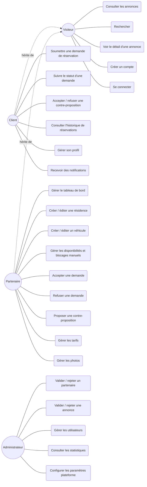

**Lecture** : UC6 (« Soumettre une demande ») et UC16-UC18 (traitement partenaire) sont les cas d'usage centraux du MVP — ils matérialisent le cycle Demande → Validation → Confirmation décrit dans [`PRODUCT.md`](./PRODUCT.md) §4. UC15 (disponibilités) est un prérequis technique à UC6 : une demande ne peut être soumise que sur un bien disponible.

## 4. Diagrammes de classes

### 4.1 Vue d'ensemble inter-domaines

Vue simplifiée montrant uniquement les classes principales et leurs relations à travers les sept domaines de [`ARCHITECTURE.md`](./ARCHITECTURE.md) §6. Le détail complet des attributs est donné dans les sous-sections 4.2 à 4.8, aligné sur [`DATABASE.md`](./DATABASE.md).

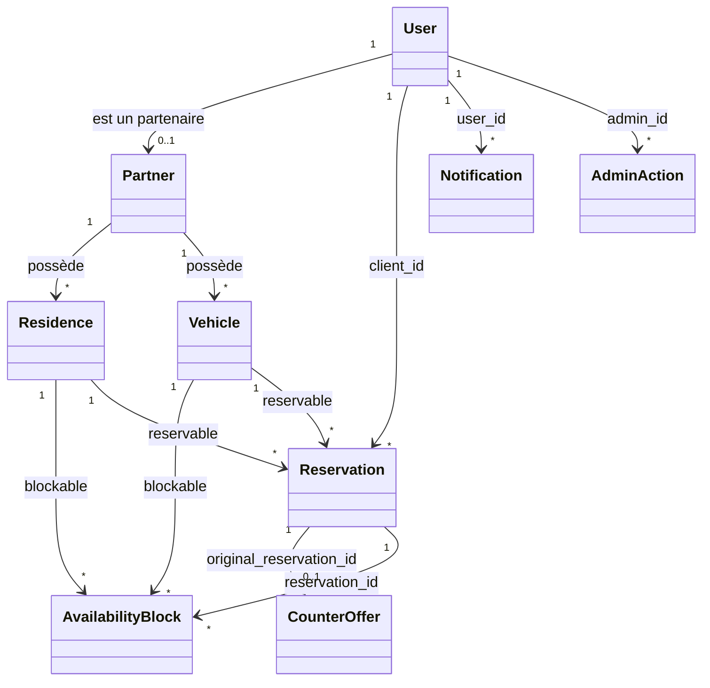

### 4.2 Domaine Identity

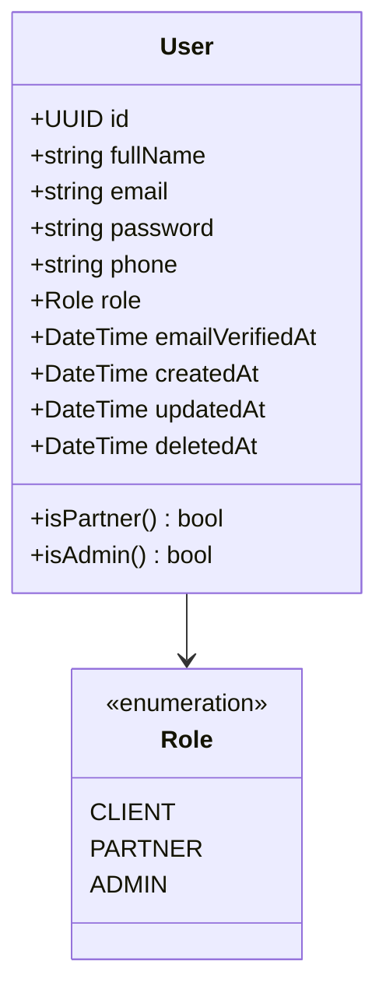

Correspond à la table `users` de [`DATABASE.md`](./DATABASE.md) §4.1. Pour le MVP, `role` est un simple champ énuméré sur `User` (pas de table `permissions` séparée — voir §4.2 de `DATABASE.md`).

### 4.3 Domaine Partners

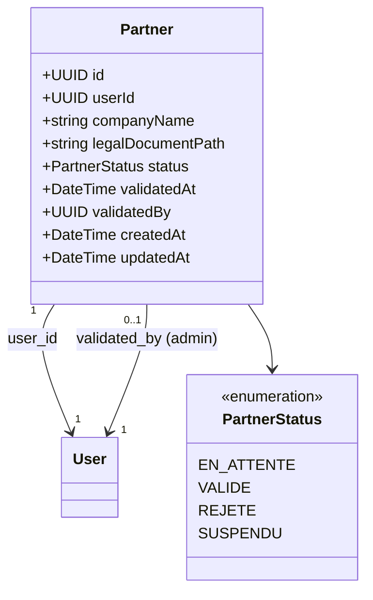

Correspond à la table `partners` de [`DATABASE.md`](./DATABASE.md) §5.1. Contrainte d'unicité : un `User` ne peut avoir qu'un seul `Partner` associé (`UNIQUE` sur `user_id`, voir `DATABASE.md` §12.2).

### 4.4 Domaine Catalogue

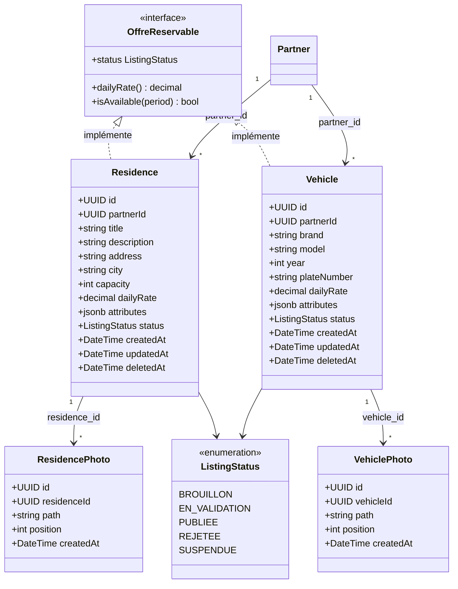

Correspond aux tables `residences`, `residence_photos`, `vehicles`, `vehicle_photos` de [`DATABASE.md`](./DATABASE.md) §6. L'interface `OffreReservable` matérialise l'abstraction d'extensibilité décrite dans [`ARCHITECTURE.md`](./ARCHITECTURE.md) §13 : toute catégorie future (hôtel, villa, salle, bureau, excursion, chauffeur) devra l'implémenter pour bénéficier du moteur de réservation existant sans modification des domaines `Availability`, `Reservation`, `Communication` et `Administration`.

### 4.5 Domaine Availability

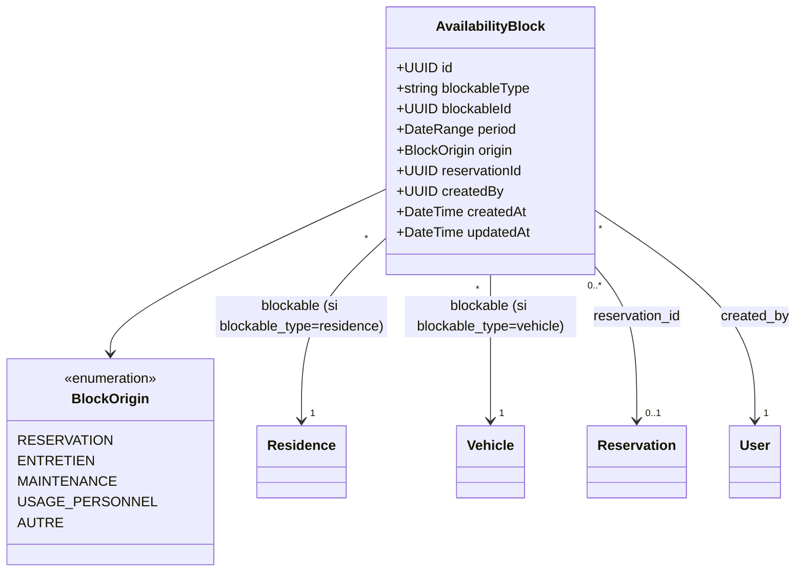

Correspond à la table polymorphique `availability_blocks` de [`DATABASE.md`](./DATABASE.md) §7. La relation vers `Residence`/`Vehicle` est polymorphe (`blockable_type` + `blockable_id`), conformément au principe d'extensibilité — voir aussi §7.3 pour la règle de non-libération automatique d'un blocage manuel.

**Invariant métier critique** (porté par une contrainte d'exclusion PostgreSQL, voir `DATABASE.md` §7.2 et §12.1) : pour un même `blockableType` + `blockableId`, deux `period` ne peuvent jamais se chevaucher. C'est la traduction technique directe de la règle d'exclusivité de [`BUSINESS_RULES.md`](./BUSINESS_RULES.md) §7.2.

### 4.6 Domaine Reservation

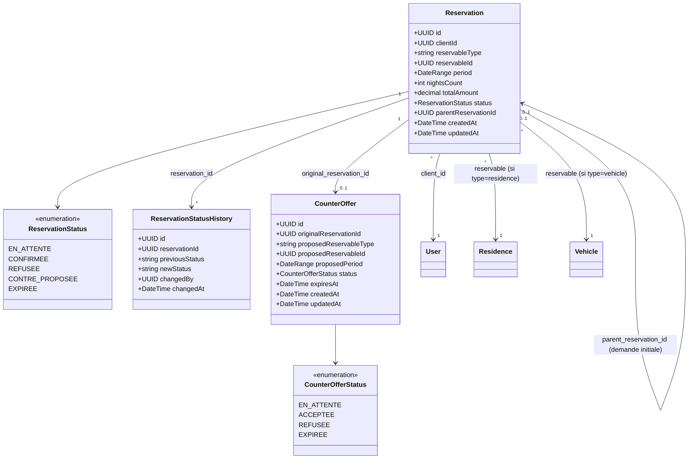

Correspond aux tables `reservations`, `reservation_status_history`, `counter_offers` de [`DATABASE.md`](./DATABASE.md) §8. `parentReservationId` matérialise le lien entre une contre-proposition acceptée et sa demande initiale, conformément à [`BUSINESS_RULES.md`](./BUSINESS_RULES.md) §6.

### 4.7 Domaine Communication

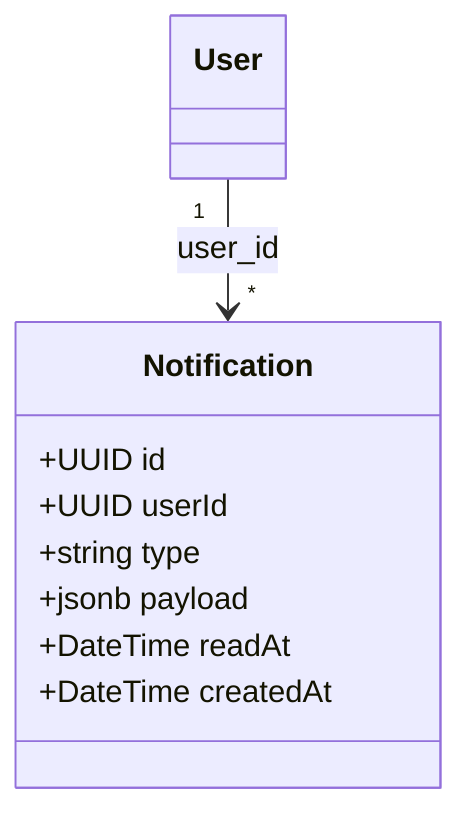

Correspond à la table `notifications` de [`DATABASE.md`](./DATABASE.md) §9. Les types de notification du MVP sont listés dans [`ARCHITECTURE.md`](./ARCHITECTURE.md) §12.

### 4.8 Domaine Administration

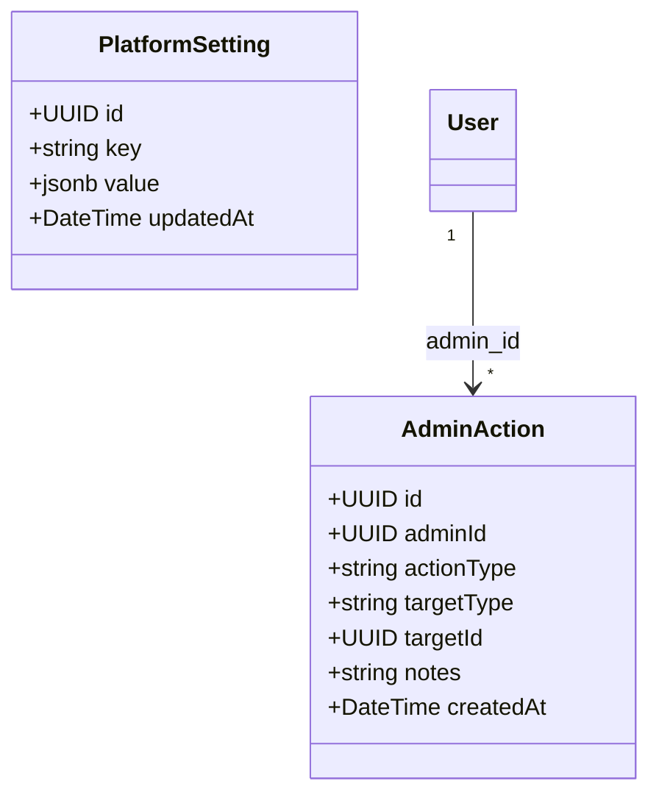

Correspond aux tables `admin_actions` et `platform_settings` de [`DATABASE.md`](./DATABASE.md) §10. `targetType` + `targetId` forment une référence polymorphe vers l'entité concernée (`partner`, `residence`, `vehicle`, `user`, etc.).

## 5. Diagrammes de séquence

Chaque séquence suit l'anatomie de domaine décrite dans [`ARCHITECTURE.md`](./ARCHITECTURE.md) §7 et reprend les flux déjà esquissés en §8 de ce même document, en les détaillant au niveau composant.

### 5.1 Demande de réservation

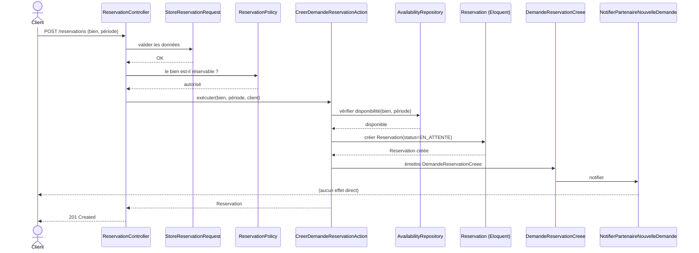

Conforme à [`ARCHITECTURE.md`](./ARCHITECTURE.md) §8.1 et [`BUSINESS_RULES.md`](./BUSINESS_RULES.md) §5.1 : aucun blocage calendrier n'est créé à cette étape.

### 5.2 Acceptation directe d'une demande

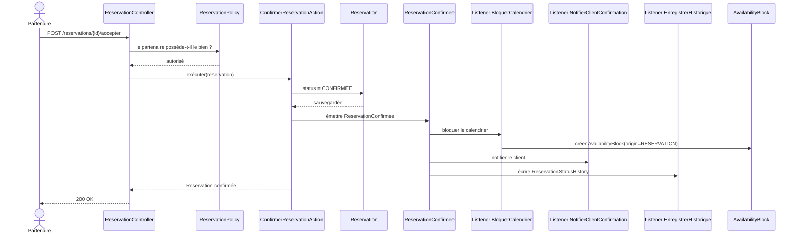

Conforme à [`ARCHITECTURE.md`](./ARCHITECTURE.md) §8.2 et [`BUSINESS_RULES.md`](./BUSINESS_RULES.md) §5.3 : blocage automatique, notification des deux parties, historisation — dans le même cycle d'événement.

### 5.3 Refus avec contre-proposition — acceptation

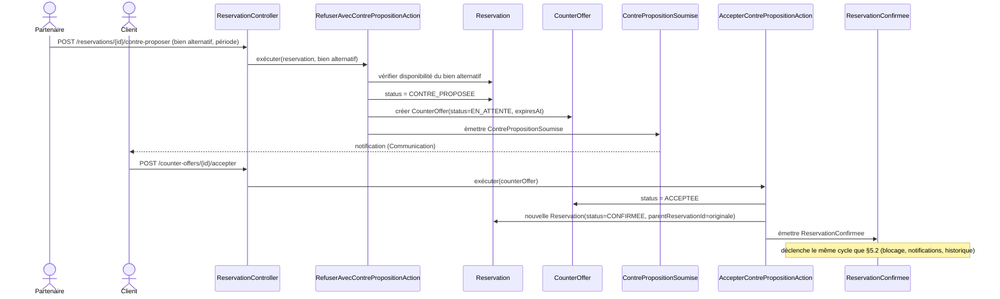

Conforme à [`BUSINESS_RULES.md`](./BUSINESS_RULES.md) §6 : une seule contre-proposition par demande refusée, portant obligatoirement sur un bien disponible au moment de la soumission.

### 5.4 Refus avec contre-proposition — expiration

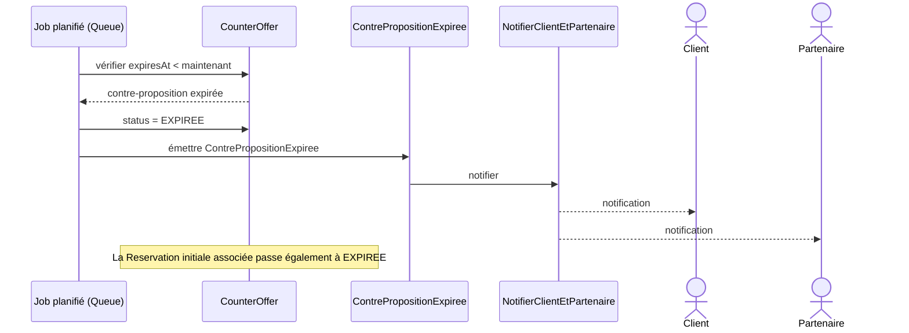

Conforme à [`BUSINESS_RULES.md`](./BUSINESS_RULES.md) §6.2 et [`ARCHITECTURE.md`](./ARCHITECTURE.md) §10 (expiration pilotée par job planifié via Redis/Queues).

### 5.5 Refus simple

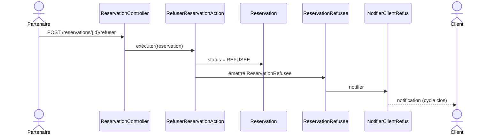

Conforme à [`BUSINESS_RULES.md`](./BUSINESS_RULES.md) §5.2 (option 2) : aucun blocage calendrier, cycle définitivement clos.

### 5.6 Blocage manuel de calendrier (véhicule)

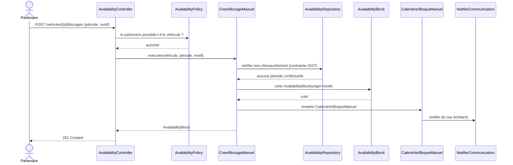

Conforme à [`BUSINESS_RULES.md`](./BUSINESS_RULES.md) §4.2 : motifs `entretien`, `maintenance`, `usage_personnel` — même priorité qu'un blocage automatique de réservation.

### 5.7 Validation d'un partenaire par l'administration

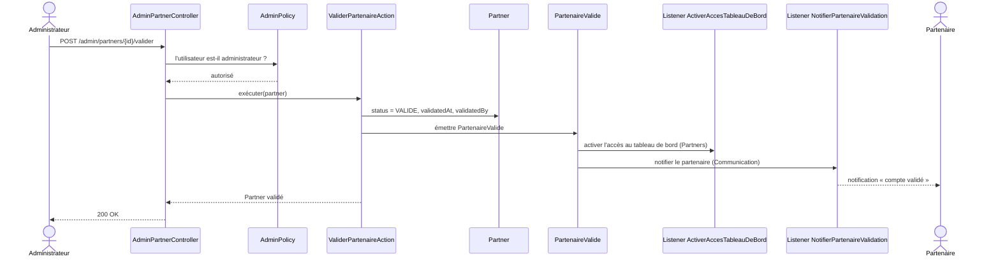

Conforme à [`ARCHITECTURE.md`](./ARCHITECTURE.md) §8.3 et [`PRODUCT.md`](./PRODUCT.md) §8.3.

### 5.8 Validation d'une annonce par l'administration

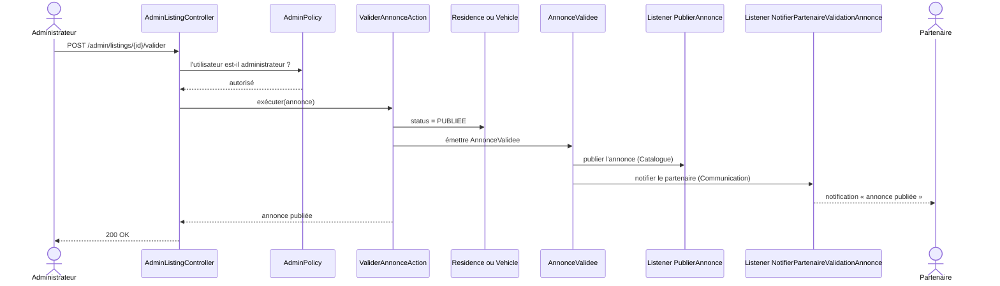

Conforme à l'événement `AnnonceValidee` listé dans [`ARCHITECTURE.md`](./ARCHITECTURE.md) §9 et au parcours de validation décrit dans [`PRODUCT.md`](./PRODUCT.md) §8.3 (« chaque annonce soumise suit également un cycle de validation avant publication »).

## 6. Diagramme d'états — Réservation

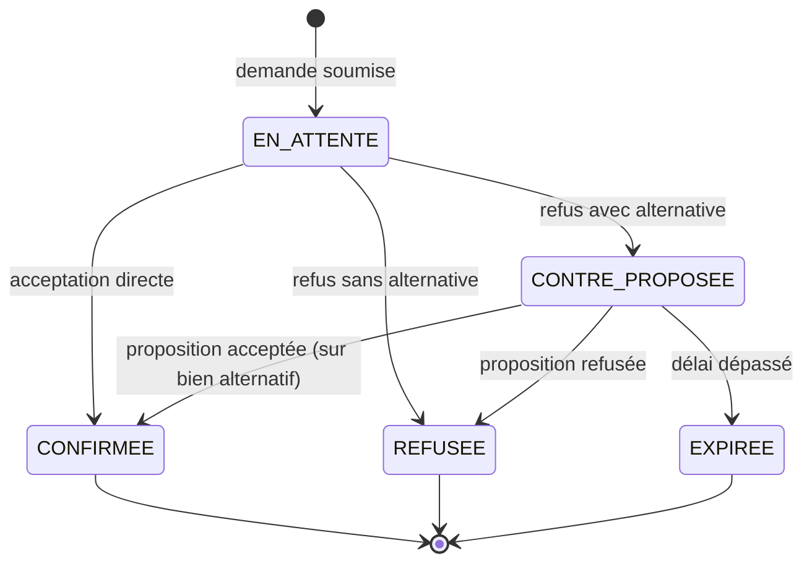

Transcription directe de la machine à états de [`BUSINESS_RULES.md`](./BUSINESS_RULES.md) §8. Chaque transition correspond à une entrée dans `reservation_status_history` (voir `DATABASE.md` §8.2).

## 7. Diagramme d'états — Contre-proposition

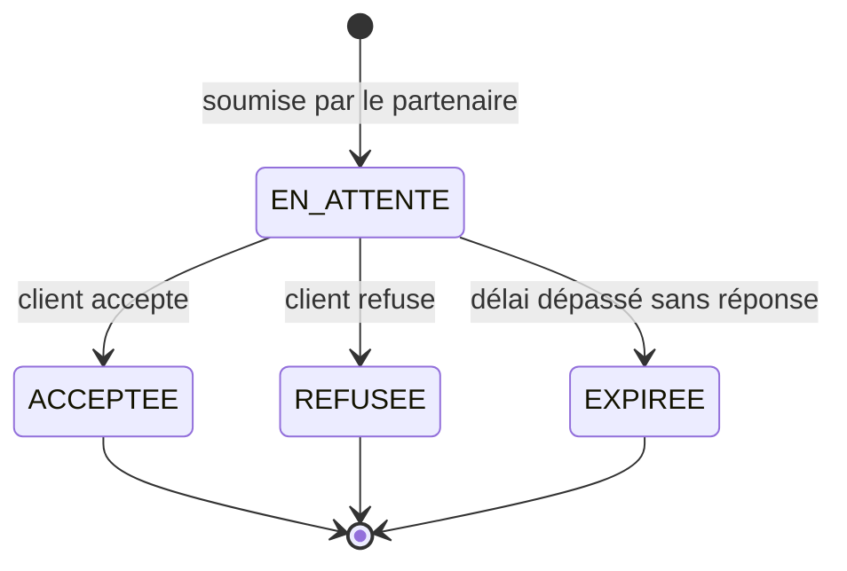

Correspond au champ `status` de la table `counter_offers` ([`DATABASE.md`](./DATABASE.md) §8.3) et aux règles de [`BUSINESS_RULES.md`](./BUSINESS_RULES.md) §6.2, y compris le cas d'invalidation automatique si le bien alternatif devient indisponible avant la réponse du client ([`BUSINESS_RULES.md`](./BUSINESS_RULES.md) §10).

## 8. Diagramme d'états — Partenaire

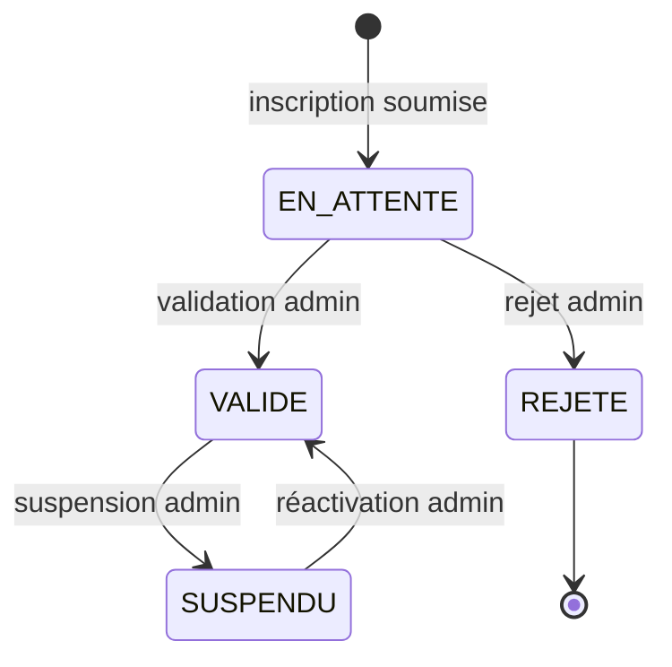

Correspond au champ `status` de la table `partners` ([`DATABASE.md`](./DATABASE.md) §5.1). La transition `SUSPENDU → VALIDE` n'est pas explicitement détaillée dans `BUSINESS_RULES.md` ; elle est déduite de la liste des valeurs d'énumération et doit être confirmée lors de la conception des règles d'administration si elle n'est pas déjà couverte.

## 9. Diagramme d'états — Annonce (Résidence / Véhicule)

```mermaid
stateDiagram-v2
    [*] --> BROUILLON : création par le partenaire
    BROUILLON --> EN_VALIDATION : soumission pour publication
    EN_VALIDATION --> PUBLIEE : validation admin
    EN_VALIDATION --> REJETEE : rejet admin
    PUBLIEE --> SUSPENDUE : suspension admin
    SUSPENDUE --> PUBLIEE : réactivation admin
    REJETEE --> BROUILLON : correction par le partenaire
```

Correspond au champ `status` des tables `residences` et `vehicles` ([`DATABASE.md`](./DATABASE.md) §6.1 et §6.3), commun aux deux catégories d'offres du MVP conformément au principe d'alignement des règles décrit dans [`BUSINESS_RULES.md`](./BUSINESS_RULES.md) §1.

## 10. Traçabilité avec la documentation existante

| Diagramme | Source(s) métier | Source(s) technique(s) |
|---|---|---|
| Cas d'utilisation | [`PRODUCT.md`](./PRODUCT.md) §6, §9 | — |
| Classes — toutes sections | — | [`DATABASE.md`](./DATABASE.md) §4-10 |
| Classes — `OffreReservable` | [`PRODUCT.md`](./PRODUCT.md) §12 | [`ARCHITECTURE.md`](./ARCHITECTURE.md) §13 |
| Séquences — cycle de réservation (§5.1-5.6) | [`BUSINESS_RULES.md`](./BUSINESS_RULES.md) §2, §5, §6 | [`ARCHITECTURE.md`](./ARCHITECTURE.md) §7, §8, §9 |
| Séquences — validation admin (§5.7-5.8) | [`PRODUCT.md`](./PRODUCT.md) §8.3 | [`ARCHITECTURE.md`](./ARCHITECTURE.md) §8.3, §9 |
| États — Réservation | [`BUSINESS_RULES.md`](./BUSINESS_RULES.md) §8 | [`DATABASE.md`](./DATABASE.md) §8.1 |
| États — Contre-proposition | [`BUSINESS_RULES.md`](./BUSINESS_RULES.md) §6 | [`DATABASE.md`](./DATABASE.md) §8.3 |
| États — Partenaire | — | [`DATABASE.md`](./DATABASE.md) §5.1 |
| États — Annonce | [`BUSINESS_RULES.md`](./BUSINESS_RULES.md) §1 | [`DATABASE.md`](./DATABASE.md) §6.1, §6.3 |

Toute modification d'une règle métier ou d'un schéma de données doit être répercutée dans ce document avant d'être considérée comme conçue, conformément au principe « aucun développement sans conception préalable » ([`ENGINEERING.md`](./ENGINEERING.md) §2).
